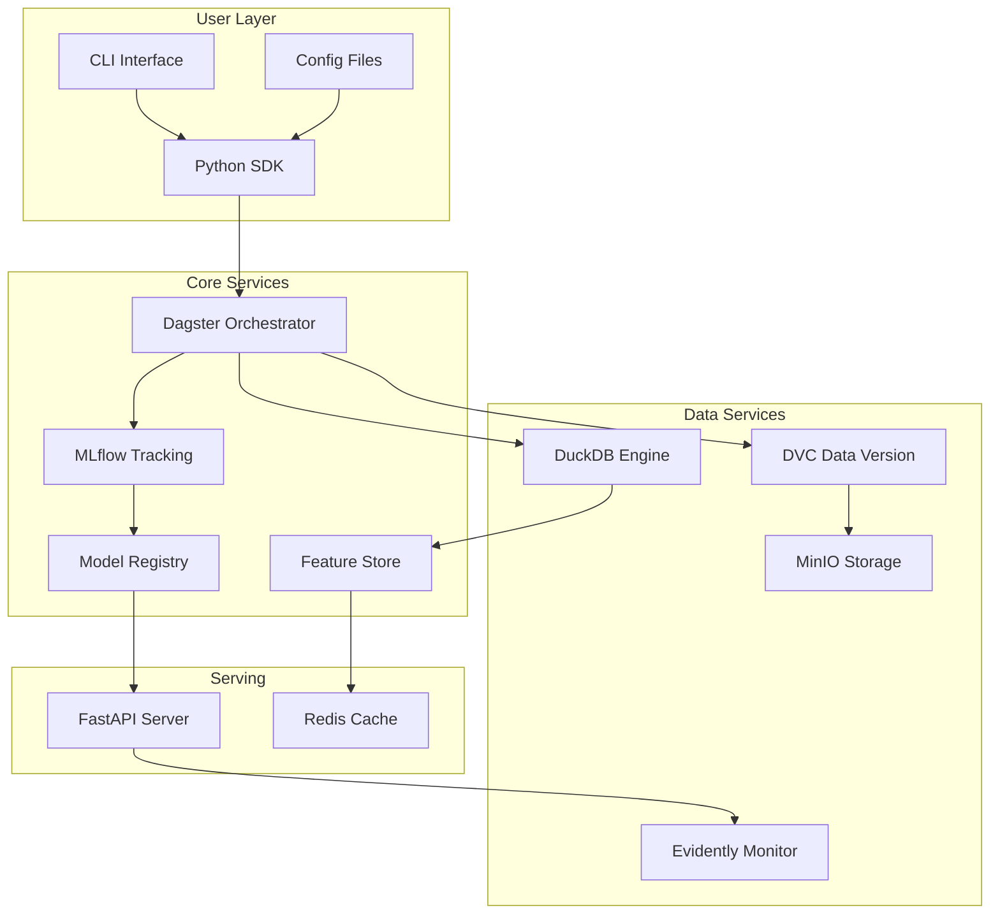

# MLForge: Comprehensive Architecture & Implementation Guide

## Executive Summary

MLForge is an end-to-end ML platform that provides a unified interface for dataset management, model training, experimentation, deployment, and monitoring. This document outlines the complete architecture, implementation strategy, and best practices for building this platform.

## 1. Architecture Overview

### 1.1 High-Level Architecture

```
┌─────────────────────────────────────────────────────────────┐
│                        User Interface Layer                   │
├───────────────┬─────────────────┬──────────────────────────┤
│      CLI      │       SDK       │      Configuration        │
│  (cyclopts)   │   (Python API)  │    (YAML/Python DSL)     │
├───────────────┴─────────────────┴──────────────────────────┤
│                    Core Platform Layer                       │
├──────────────────────────────────────────────────────────────┤
│  Orchestration │ Experiment  │  Model      │   Feature      │
│   (Dagster)    │  Tracking   │  Registry   │    Store       │
│                │  (MLflow)   │  (MLflow)   │ (Redis/DuckDB) │
├──────────────────────────────────────────────────────────────┤
│                    Data & Compute Layer                      │
├──────────────────────────────────────────────────────────────┤
│  Data Version  │   Storage   │   Compute   │   Monitoring   │
│     (DVC)      │   (MinIO)   │  (DuckDB/   │  (Evidently)   │
│                │             │   Polars)   │                │
├──────────────────────────────────────────────────────────────┤
│                   Infrastructure Layer                       │
├──────────────────────────────────────────────────────────────┤
│           Docker Containers & Kubernetes (future)            │
└──────────────────────────────────────────────────────────────┘
```

### 1.2 Component Interactions



## 2. Detailed Component Design

### 2.1 Package Structure

```
mlforge/
├── pyproject.toml              # UV package management
├── README.md
├── docs/
│   ├── architecture/
│   ├── api/
│   └── tutorials/
├── mlforge/                    # Core package
│   ├── __init__.py
│   ├── core/                   # Core platform logic
│   │   ├── orchestration/
│   │   │   ├── __init__.py
│   │   │   ├── dagster_assets.py
│   │   │   ├── dagster_jobs.py
│   │   │   ├── dagster_sensors.py
│   │   │   └── dagster_schedules.py
│   │   ├── tracking/
│   │   │   ├── __init__.py
│   │   │   ├── mlflow_client.py
│   │   │   ├── experiment_manager.py
│   │   │   └── metrics_logger.py
│   │   ├── registry/
│   │   │   ├── __init__.py
│   │   │   ├── model_registry.py
│   │   │   ├── model_versioning.py
│   │   │   └── deployment_manager.py
│   │   ├── feature_store/
│   │   │   ├── __init__.py
│   │   │   ├── offline_store.py    # DuckDB
│   │   │   ├── online_store.py     # Redis
│   │   │   ├── feature_registry.py
│   │   │   └── feature_server.py
│   │   ├── data/
│   │   │   ├── __init__.py
│   │   │   ├── dvc_manager.py
│   │   │   ├── dataset_registry.py
│   │   │   ├── data_quality.py
│   │   │   └── lineage_tracker.py
│   │   ├── compute/
│   │   │   ├── __init__.py
│   │   │   ├── duckdb_engine.py
│   │   │   ├── polars_engine.py
│   │   │   └── compute_manager.py
│   │   ├── monitoring/
│   │   │   ├── __init__.py
│   │   │   ├── evidently_monitor.py
│   │   │   ├── drift_detector.py
│   │   │   ├── performance_tracker.py
│   │   │   └── alert_manager.py
│   │   └── serving/
│   │       ├── __init__.py
│   │       ├── fastapi_server.py
│   │       ├── model_loader.py
│   │       ├── prediction_service.py
│   │       └── api_models.py
│   ├── sdk/                    # User-facing SDK
│   │   ├── __init__.py
│   │   ├── client.py           # Main MLForge client
│   │   ├── datasets/
│   │   │   ├── __init__.py
│   │   │   ├── dataset.py
│   │   │   └── transformations.py
│   │   ├── models/
│   │   │   ├── __init__.py
│   │   │   ├── base_model.py
│   │   │   ├── training.py
│   │   │   └── evaluation.py
│   │   ├── pipelines/
│   │   │   ├── __init__.py
│   │   │   ├── pipeline.py
│   │   │   └── components.py
│   │   ├── deployment/
│   │   │   ├── __init__.py
│   │   │   ├── deploy.py
│   │   │   └── strategies.py
│   │   └── config/
│   │       ├── __init__.py
│   │       ├── parser.py
│   │       └── validators.py
│   ├── cli/                    # CLI implementation
│   │   ├── __init__.py
│   │   ├── main.py
│   │   ├── commands/
│   │   │   ├── __init__.py
│   │   │   ├── init.py
│   │   │   ├── train.py
│   │   │   ├── deploy.py
│   │   │   ├── monitor.py
│   │   │   └── data.py
│   │   └── utils/
│   │       ├── __init__.py
│   │       └── output.py
│   └── utils/                  # Shared utilities
│       ├── __init__.py
│       ├── logging.py
│       ├── exceptions.py
│       ├── decorators.py
│       └── patterns/          # Design patterns
│           ├── __init__.py
│           ├── singleton.py
│           ├── factory.py
│           ├── strategy.py
│           └── observer.py
├── tests/
│   ├── unit/
│   ├── integration/
│   └── e2e/
├── examples/
│   ├── quickstart/
│   ├── advanced/
│   └── production/
└── docker/
    ├── Dockerfile
    ├── docker-compose.yml
    └── services/
        ├── mlflow/
        ├── minio/
        ├── redis/
        └── dagster/
```

## 3. SDK Design Patterns & Best Practices

### 3.1 Core Design Patterns

#### Builder Pattern for Pipeline Construction
```python
"""Pipeline builder module for creating ML pipelines.

Provides a fluent interface for constructing machine learning pipelines
with various processing steps.
"""

from __future__ import annotations

from abc import ABC, abstractmethod
from typing import Any


class PipelineBuilder:
    """Fluent interface for building ML pipelines.

    Attributes:
        name: The name of the pipeline.
    """

    def __init__(self, name: str) -> None:
        """Initializes the pipeline builder.

        Args:
            name: The name of the pipeline to build.
        """
        self.name = name
        self._steps: list[PipelineStep] = []
        self._config: dict[str, Any] = {}

    def with_dataset(
        self,
        dataset_name: str,
        version: str | None = None,
    ) -> PipelineBuilder:
        """Adds dataset to pipeline.

        Args:
            dataset_name: Name of the dataset to use.
            version: Optional version of the dataset. Defaults to latest.

        Returns:
            The pipeline builder instance for method chaining.
        """
        self._steps.append(DatasetStep(dataset_name, version))
        return self

    def with_feature_engineering(
        self,
        transformations: list[Transformation],
    ) -> PipelineBuilder:
        """Adds feature engineering step.

        Args:
            transformations: List of transformations to apply.

        Returns:
            The pipeline builder instance for method chaining.
        """
        self._steps.append(FeatureEngineeringStep(transformations))
        return self

    def with_training(
        self,
        model_class: type,
        hyperparameters: dict[str, Any],
    ) -> PipelineBuilder:
        """Adds training step.

        Args:
            model_class: The model class to instantiate.
            hyperparameters: Dictionary of hyperparameters for the model.

        Returns:
            The pipeline builder instance for method chaining.
        """
        self._steps.append(TrainingStep(model_class, hyperparameters))
        return self

    def with_evaluation(self, metrics: list[str]) -> PipelineBuilder:
        """Adds evaluation step.

        Args:
            metrics: List of metric names to compute.

        Returns:
            The pipeline builder instance for method chaining.
        """
        self._steps.append(EvaluationStep(metrics))
        return self

    def with_deployment(
        self,
        strategy: DeploymentStrategy,
    ) -> PipelineBuilder:
        """Adds deployment step.

        Args:
            strategy: The deployment strategy to use.

        Returns:
            The pipeline builder instance for method chaining.
        """
        self._steps.append(DeploymentStep(strategy))
        return self

    def build(self) -> Pipeline:
        """Builds and validates the pipeline.

        Returns:
            A configured Pipeline instance ready for execution.
        """
        return Pipeline(self.name, self._steps, self._config)
```

#### Strategy Pattern for Deployment
```python
"""Deployment strategies for ML models.

Provides different deployment strategies including blue-green, canary,
and champion-challenger approaches.
"""

from __future__ import annotations

from abc import ABC, abstractmethod


class DeploymentStrategy(ABC):
    """Base strategy for model deployment."""

    @abstractmethod
    def deploy(self, model: Model, endpoint: str) -> DeploymentResult:
        """Deploys a model to the specified endpoint.

        Args:
            model: The model to deploy.
            endpoint: The target deployment endpoint.

        Returns:
            Information about the deployment result.
        """

    @abstractmethod
    def validate(self, deployment: DeploymentResult) -> bool:
        """Validates the deployment.

        Args:
            deployment: The deployment to validate.

        Returns:
            True if deployment is valid, False otherwise.
        """


class BlueGreenDeployment(DeploymentStrategy):
    """Blue-green deployment strategy.

    Attributes:
        traffic_percentage: Percentage of traffic to route to new version.
    """

    def __init__(self, traffic_percentage: float = 0.1) -> None:
        """Initializes blue-green deployment.

        Args:
            traffic_percentage: Initial traffic percentage for new version.
                Must be between 0 and 1.
        """
        self.traffic_percentage = traffic_percentage

    def deploy(self, model: Model, endpoint: str) -> DeploymentResult:
        """Deploys model using blue-green strategy.

        Args:
            model: The model to deploy.
            endpoint: The target deployment endpoint.

        Returns:
            Information about the deployment result.
        """
        # Implementation for blue-green deployment
        pass


class CanaryDeployment(DeploymentStrategy):
    """Canary deployment with gradual rollout.

    Attributes:
        initial_traffic: Initial traffic percentage for canary.
        increment: Traffic increment per evaluation period.
        evaluation_period: Duration in seconds between traffic increments.
    """

    def __init__(
        self,
        initial_traffic: float = 0.05,
        increment: float = 0.1,
        evaluation_period: int = 300,
    ) -> None:
        """Initializes canary deployment.

        Args:
            initial_traffic: Initial traffic percentage for canary version.
            increment: Traffic percentage to add each evaluation period.
            evaluation_period: Time in seconds to wait between increments.
        """
        self.initial_traffic = initial_traffic
        self.increment = increment
        self.evaluation_period = evaluation_period

    def deploy(self, model: Model, endpoint: str) -> DeploymentResult:
        """Deploys model using canary strategy.

        Args:
            model: The model to deploy.
            endpoint: The target deployment endpoint.

        Returns:
            Information about the deployment result.
        """
        # Implementation for canary deployment
        pass


class ChampionChallengerDeployment(DeploymentStrategy):
    """A/B testing deployment strategy.

    Attributes:
        challenger_traffic: Traffic percentage for challenger model.
        evaluation_metrics: Metrics to evaluate for promotion.
    """

    def __init__(
        self,
        challenger_traffic: float = 0.5,
        evaluation_metrics: list[str] | None = None,
    ) -> None:
        """Initializes champion-challenger deployment.

        Args:
            challenger_traffic: Traffic percentage for challenger model.
            evaluation_metrics: List of metrics to compare. Defaults to
                accuracy and latency.
        """
        self.challenger_traffic = challenger_traffic
        self.evaluation_metrics = evaluation_metrics or ['accuracy', 'latency']

    def deploy(self, model: Model, endpoint: str) -> DeploymentResult:
        """Deploys model using champion-challenger strategy.

        Args:
            model: The model to deploy.
            endpoint: The target deployment endpoint.

        Returns:
            Information about the deployment result.
        """
        # Implementation for champion-challenger
        pass
```

#### Factory Pattern for Model Creation
```python
"""Model factory for creating ML model instances.

Provides a registry-based factory pattern for model creation with
support for automatic registration via decorators.
"""

from __future__ import annotations

from abc import ABC, abstractmethod
from typing import Any


class ModelFactory:
    """Factory for creating ML models.

    Maintains a registry of model classes and provides methods for
    registration and instantiation.
    """

    _models: dict[str, type[BaseModel]] = {}

    @classmethod
    def register(cls, name: str, model_class: type[BaseModel]) -> None:
        """Registers a new model type.

        Args:
            name: Identifier for the model type.
            model_class: The model class to register.
        """
        cls._models[name] = model_class

    @classmethod
    def create(cls, model_type: str, **kwargs: Any) -> BaseModel:
        """Creates a model instance.

        Args:
            model_type: The type of model to create.
            **kwargs: Keyword arguments to pass to model constructor.

        Returns:
            An instance of the requested model type.

        Raises:
            ValueError: If model_type is not registered.
        """
        if model_type not in cls._models:
            raise ValueError(f'Unknown model type: {model_type}')
        return cls._models[model_type](**kwargs)

    @classmethod
    def list_available(cls) -> list[str]:
        """Lists all registered model types.

        Returns:
            List of registered model type identifiers.
        """
        return list(cls._models.keys())


def register_model(name: str):
    """Decorator for automatic model registration.

    Args:
        name: Identifier for the model type.

    Returns:
        Decorator function that registers the class.
    """
    def decorator(cls):
        ModelFactory.register(name, cls)
        return cls
    return decorator


@register_model('xgboost')
class XGBoostModel(BaseModel):
    """XGBoost model implementation."""


@register_model('lightgbm')
class LightGBMModel(BaseModel):
    """LightGBM model implementation."""
```

### 3.2 SDK Client Design

```python
"""MLForge SDK client for platform interaction.

Provides the main client interface for interacting with the MLForge platform,
including dataset management, experiments, models, and deployments.
"""

from __future__ import annotations

import logging
from contextlib import contextmanager
from typing import Any


class MLForgeClient:
    """Main client for interacting with MLForge platform.

    Attributes:
        config: The loaded configuration.
        environment: The environment name (e.g., 'development', 'production').
        datasets: Dataset management interface.
        experiments: Experiment management interface.
        models: Model management interface.
        pipelines: Pipeline management interface.
        feature_store: Feature store interface.
        monitor: Monitoring interface.
    """

    def __init__(
        self,
        config_path: str | None = None,
        environment: str = 'development',
    ) -> None:
        """Initializes the MLForge client.

        Args:
            config_path: Path to configuration file. If None, uses defaults.
            environment: The environment to use (e.g., 'development').
        """
        self.config = self._load_config(config_path)
        self.environment = environment
        self._initialize_components()

    def _initialize_components(self) -> None:
        """Initializes all platform components."""
        self.datasets = DatasetManager(self.config)
        self.experiments = ExperimentManager(self.config)
        self.models = ModelManager(self.config)
        self.pipelines = PipelineManager(self.config)
        self.feature_store = FeatureStore(self.config)
        self.monitor = MonitoringManager(self.config)

    @contextmanager
    def experiment(
        self,
        name: str,
        tags: dict[str, Any] | None = None,
    ):
        """Context manager for experiments.

        Args:
            name: Name of the experiment.
            tags: Optional tags to attach to the experiment.

        Yields:
            An experiment instance for tracking.

        Raises:
            Exception: Re-raises any exception that occurs during the experiment.
        """
        experiment = self.experiments.create(name, tags)
        try:
            yield experiment
            experiment.end(status='success')
        except Exception as e:
            experiment.end(status='failed', error=str(e))
            raise

    def create_pipeline(self, name: str) -> PipelineBuilder:
        """Creates a new pipeline.

        Args:
            name: Name of the pipeline to create.

        Returns:
            A PipelineBuilder instance for constructing the pipeline.
        """
        return PipelineBuilder(name)

    def deploy_model(
        self,
        model_name: str,
        version: str,
        endpoint: str,
        strategy: DeploymentStrategy | None = None,
    ):
        """Deploys a model to an endpoint.

        Args:
            model_name: Name of the model to deploy.
            version: Version of the model to deploy.
            endpoint: Target deployment endpoint.
            strategy: Deployment strategy to use. Defaults to BlueGreenDeployment.

        Returns:
            Deployment result information.
        """
        strategy = strategy or BlueGreenDeployment()
        model = self.models.get(model_name, version)
        return strategy.deploy(model, endpoint)

    def get_feature_set(self, name: str) -> FeatureSet:
        """Retrieves a feature set from the feature store.

        Args:
            name: Name of the feature set to retrieve.

        Returns:
            The requested FeatureSet instance.
        """
        return self.feature_store.get_feature_set(name)
```

## 4. Configuration Management

### 4.1 YAML Configuration Example

```yaml
# mlforge.yaml
project:
  name: "customer-churn-prediction"
  version: "1.0.0"
  description: "Predict customer churn using transaction data"

infrastructure:
  storage:
    type: "minio"
    endpoint: "localhost:9000"
    bucket: "mlforge-data"
  
  compute:
    engine: "duckdb"
    memory_limit: "8GB"
    threads: 4
  
  tracking:
    backend: "mlflow"
    uri: "http://localhost:5000"
  
  orchestration:
    backend: "dagster"
    workspace: "./dagster_workspace.yaml"

datasets:
  - name: "customer_transactions"
    path: "s3://mlforge-data/transactions/"
    version: "v1.2.0"
    format: "parquet"
    partitions:
      - year
      - month
    
  - name: "customer_features"
    path: "s3://mlforge-data/features/"
    version: "latest"
    format: "delta"

feature_engineering:
  transformations:
    - type: "aggregate"
      config:
        group_by: ["customer_id"]
        aggregations:
          - column: "amount"
            functions: ["sum", "mean", "std"]
          - column: "transaction_count"
            functions: ["count"]
    
    - type: "window"
      config:
        window_size: 30
        step_size: 1
        features: ["rolling_mean", "rolling_std"]

models:
  - name: "churn_classifier"
    type: "xgboost"
    hyperparameters:
      n_estimators: 100
      max_depth: 5
      learning_rate: 0.1
    
    training:
      split_ratio: 0.8
      validation_strategy: "time_series_split"
      n_splits: 5
    
    evaluation:
      metrics: ["accuracy", "precision", "recall", "f1", "auc_roc"]
      threshold_optimization: true

deployment:
  strategy: "champion_challenger"
  endpoints:
    - name: "churn-prediction-api"
      url: "/predict/churn"
      model: "churn_classifier"
      version: "production"
  
  monitoring:
    drift_detection: true
    performance_tracking: true
    alert_thresholds:
      accuracy: 0.85
      latency_p99: 100  # ms
```

### 4.2 Python DSL Alternative

```python
"""MLForge configuration using Python DSL.

Example configuration for customer churn prediction pipeline.
"""

from mlforge.sdk import Config, Dataset, Model, Pipeline, Deployment

config = Config(
    project_name='customer-churn-prediction',
    version='1.0.0'
)

# Define datasets
transactions = Dataset(
    name='customer_transactions',
    path='s3://mlforge-data/transactions/',
    version='v1.2.0',
    format='parquet',
    partitions=['year', 'month']
)

# Define pipeline
pipeline = (Pipeline('churn_prediction_pipeline')
    .with_dataset(transactions)
    .with_feature_engineering([
        Aggregation(group_by=['customer_id'],
                   aggregations={'amount': ['sum', 'mean', 'std']}),
        WindowFeatures(window_size=30, features=['rolling_mean', 'rolling_std'])
    ])
    .with_training(
        model=XGBoostClassifier(
            n_estimators=100,
            max_depth=5,
            learning_rate=0.1
        ),
        split_ratio=0.8,
        validation_strategy='time_series_split'
    )
    .with_evaluation(metrics=['accuracy', 'precision', 'recall', 'f1', 'auc_roc'])
    .with_deployment(
        strategy=ChampionChallengerDeployment(
            challenger_traffic=0.3,
            evaluation_metrics=['accuracy', 'latency']
        ),
        endpoint='/predict/churn'
    )
    .build()
)

config.register_pipeline(pipeline)
```

## 5. CLI Design

### 5.1 CLI Command Structure

```python
"""MLForge CLI for managing ML projects.

Provides command-line interface for project initialization, training,
deployment, monitoring, and data management.
"""

from __future__ import annotations

import cyclopts
from pathlib import Path


app = cyclopts.App()


@app.command
def init(
    project_name: str,
    template: str = 'basic',
    path: Path | None = None,
) -> None:
    """Initializes a new MLForge project.

    Args:
        project_name: Name of the project to create.
        template: Project template to use.
        path: Parent directory path. Defaults to current working directory.
    """
    path = path or Path.cwd()
    project_path = path / project_name

    # Create project structure
    create_project_structure(project_path, template)

    # Initialize configuration
    create_default_config(project_path)

    # Setup local services
    if prompt_yes_no('Setup local services with Docker?'):
        setup_docker_services(project_path)

    print(f"✓ Project '{project_name}' created at {project_path}")


@app.command
def train(
    config: Path = Path('mlforge.yaml'),
    experiment_name: str | None = None,
    async_execution: bool = False,
) -> None:
    """Trains a model using configuration.

    Args:
        config: Path to configuration file.
        experiment_name: Name for the experiment. Defaults to 'default'.
        async_execution: Whether to run training asynchronously.
    """
    client = MLForgeClient(config_path=config)

    with client.experiment(experiment_name or 'default') as exp:
        pipeline = client.load_pipeline_from_config()

        if async_execution:
            job_id = pipeline.submit()
            print(f'✓ Training job submitted: {job_id}')
        else:
            result = pipeline.run()
            print(f'✓ Training completed. Model: {result.model_id}')
            print(f'  Metrics: {result.metrics}')


@app.command
def deploy(
    model_name: str,
    version: str = 'latest',
    endpoint: str = 'default',
    strategy: str = 'blue_green',
    config: Path = Path('mlforge.yaml'),
) -> None:
    """Deploys a model to serving endpoint.

    Args:
        model_name: Name of the model to deploy.
        version: Model version to deploy.
        endpoint: Target deployment endpoint.
        strategy: Deployment strategy (blue_green, canary, champion_challenger).
        config: Path to configuration file.
    """
    client = MLForgeClient(config_path=config)

    deployment_strategy = create_deployment_strategy(strategy)
    result = client.deploy_model(model_name, version, endpoint, deployment_strategy)

    print(f'✓ Model deployed to {endpoint}')
    print(f'  Strategy: {strategy}')
    print(f'  URL: {result.url}')


@app.command
def monitor(
    endpoint: str = 'all',
    metrics: bool = True,
    drift: bool = True,
    live: bool = False,
) -> None:
    """Monitors deployed models.

    Args:
        endpoint: Endpoint to monitor. Use 'all' for all endpoints.
        metrics: Whether to show performance metrics.
        drift: Whether to show drift detection results.
        live: Whether to start live monitoring dashboard.
    """
    client = MLForgeClient()

    if live:
        # Start live monitoring dashboard
        from mlforge.core.monitoring import start_dashboard
        start_dashboard(endpoint, show_metrics=metrics, show_drift=drift)
    else:
        # Get monitoring snapshot
        report = client.monitor.get_report(endpoint)
        print_monitoring_report(report)


@app.command
def data(
    action: str,
    dataset: str,
    version: str | None = None,
) -> None:
    """Manages datasets.

    Args:
        action: Action to perform (list, register, validate).
        dataset: Name of the dataset.
        version: Version of the dataset.
    """
    client = MLForgeClient()

    if action == 'list':
        datasets = client.datasets.list()
        print_datasets_table(datasets)

    elif action == 'register':
        client.datasets.register(dataset, version)
        print(f"✓ Dataset '{dataset}' registered")

    elif action == 'validate':
        result = client.datasets.validate(dataset, version)
        print_validation_report(result)


if __name__ == '__main__':
    app()
```

## 6. Implementation Roadmap

### Phase 1: Core Foundation (Weeks 1-4)
- [ ] Project structure setup with UV
- [ ] Basic SDK client implementation
- [ ] Docker compose for local services
- [ ] Simple dataset management with DVC
- [ ] Basic MLflow integration

### Phase 2: Orchestration & Training (Weeks 5-8)
- [ ] Dagster integration for orchestration
- [ ] Pipeline builder implementation
- [ ] Training job management
- [ ] Experiment tracking
- [ ] Model registry integration

### Phase 3: Feature Store & Serving (Weeks 9-12)
- [ ] Feature store with DuckDB/Redis
- [ ] FastAPI serving endpoint
- [ ] Model loading and caching
- [ ] Deployment strategies implementation
- [ ] Basic monitoring with Evidently

### Phase 4: Advanced Features (Weeks 13-16)
- [ ] Advanced monitoring and alerting
- [ ] Data lineage tracking
- [ ] AutoML capabilities
- [ ] Distributed training support
- [ ] Production hardening

## 7. Key Improvements to Your Plan

### 7.1 Additional Components Needed

1. **Service Mesh/API Gateway**: Consider adding Kong or Traefik for API management
2. **Secrets Management**: Add HashiCorp Vault or AWS Secrets Manager integration
3. **Message Queue**: Add Kafka or RabbitMQ for async processing
4. **Metadata Store**: Consider adding a dedicated metadata database (PostgreSQL)
5. **Caching Layer**: Implement multi-level caching (Redis + local cache)

### 7.2 Architecture Enhancements

1. **Event-Driven Architecture**: Implement event sourcing for audit trails
2. **Plugin System**: Make the platform extensible with plugins
3. **Multi-tenancy**: Design for multiple teams/projects from the start
4. **Resource Management**: Add resource quotas and scheduling
5. **Security**: Implement RBAC, API authentication, and data encryption

### 7.3 Development Practices

1. **API Versioning**: Implement versioning strategy for SDK and REST APIs
2. **Testing Strategy**: 
   - Unit tests with pytest
   - Integration tests with testcontainers
   - E2E tests with real services
   - Property-based testing with Hypothesis

3. **Documentation**:
   - API documentation with Sphinx
   - Interactive examples with Jupyter notebooks
   - Video tutorials for common workflows

4. **Observability**:
   - Structured logging with structlog
   - Metrics with Prometheus
   - Tracing with OpenTelemetry
   - Dashboards with Grafana

### 7.4 SOLID Principles Application

1. **Single Responsibility**: Each module handles one aspect (data, training, serving)
2. **Open/Closed**: Plugin system for extensions without modifying core
3. **Liskov Substitution**: All strategies/engines implement consistent interfaces
4. **Interface Segregation**: Separate interfaces for different user roles
5. **Dependency Inversion**: Core depends on abstractions, not implementations

## 8. Example Usage Scenarios

### 8.1 Basic Training Pipeline

```python
"""Example: Basic training pipeline for customer churn prediction."""

from mlforge import MLForgeClient
from mlforge.sdk import Pipeline, XGBoostClassifier

# Initialize client
client = MLForgeClient()

# Create and run pipeline
with client.experiment('customer_churn_v1') as exp:
    pipeline = (Pipeline('churn_prediction')
        .with_dataset('customer_data', version='latest')
        .with_feature_engineering([
            StandardScaler(),
            PCATransform(n_components=10)
        ])
        .with_training(
            model=XGBoostClassifier(n_estimators=100),
            split_ratio=0.8
        )
        .with_evaluation(metrics=['accuracy', 'f1'])
        .build())

    result = pipeline.run()
    print(f'Model ID: {result.model_id}')
    print(f"Accuracy: {result.metrics['accuracy']}")
```

### 8.2 Feature Store Usage

```python
"""Example: Feature store registration and retrieval."""

from mlforge import MLForgeClient
from mlforge.sdk.features import Feature, FeatureView

client = MLForgeClient()

# Define features
customer_features = FeatureView(
    name='customer_features',
    entities=['customer_id'],
    features=[
        Feature('total_purchases', dtype='float'),
        Feature('days_since_last_purchase', dtype='int'),
        Feature('average_order_value', dtype='float')
    ],
    ttl=3600  # 1 hour cache
)

# Register feature view
client.feature_store.register(customer_features)

# Get features for inference
features = client.feature_store.get_online_features(
    feature_views=['customer_features'],
    entity_values={'customer_id': ['cust_123', 'cust_456']}
)
```

### 8.3 Model Deployment with Monitoring

```python
"""Example: Model deployment with champion-challenger strategy and monitoring."""

from mlforge import MLForgeClient
from mlforge.sdk.deployment import ChampionChallengerDeployment
from mlforge.sdk.monitoring import DriftMonitor, PerformanceMonitor

client = MLForgeClient()

# Deploy with champion-challenger strategy
deployment = client.deploy_model(
    model_name='churn_classifier',
    version='v2.0',
    endpoint='production',
    strategy=ChampionChallengerDeployment(
        challenger_traffic=0.2,
        evaluation_period=3600,
        promotion_criteria={'f1': 0.85}
    )
)

# Setup monitoring
client.monitor.add_monitor(
    endpoint='production',
    monitors=[
        DriftMonitor(reference_dataset='training_data_v2'),
        PerformanceMonitor(metrics=['latency', 'error_rate'])
    ]
)

# Get monitoring report
report = client.monitor.get_report('production')
print(f'Drift detected: {report.drift_detected}')
print(f'P95 latency: {report.latency_p95}ms')
```

## 9. Production Considerations

### 9.1 Scalability
- Horizontal scaling of serving endpoints
- Distributed training with Ray or Dask
- Partitioned feature computation
- Caching at multiple levels

### 9.2 Reliability
- Circuit breakers for external services
- Retry logic with exponential backoff
- Graceful degradation
- Health checks and readiness probes

### 9.3 Security
- End-to-end encryption for data
- API key management
- Role-based access control
- Audit logging for compliance

### 9.4 Performance
- Model optimization (quantization, pruning)
- Batch prediction capabilities
- Async processing for long-running jobs
- Connection pooling for databases

## 10. Conclusion

MLForge represents a comprehensive ML platform that addresses the full lifecycle of machine learning projects. The architecture leverages best-in-class open-source tools while providing a unified, developer-friendly interface through the SDK and CLI.

Key strengths of this design:
- **Modularity**: Each component can be developed and scaled independently
- **Extensibility**: Plugin architecture allows for custom implementations
- **Developer Experience**: Clean SDK with familiar patterns from tools like Prefect
- **Production Ready**: Built-in monitoring, versioning, and deployment strategies
- **Best Practices**: SOLID principles and design patterns throughout

Next steps:
1. Set up the basic project structure
2. Implement core SDK client
3. Create Docker compose for local development
4. Build first end-to-end pipeline
5. Iterate based on user feedback

This architecture provides a solid foundation that can grow from a local development tool to a production-grade ML platform serving multiple teams and use cases.